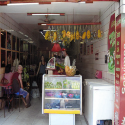
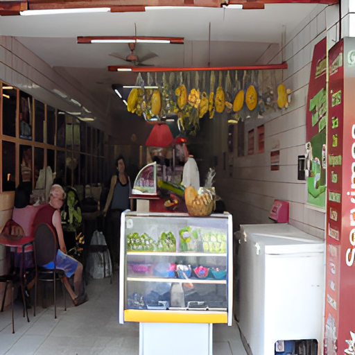
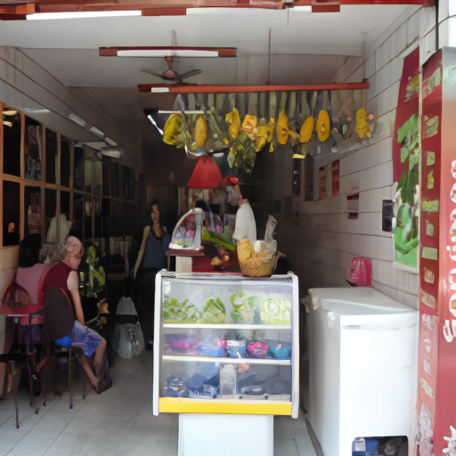

# 2025 Inha AI Challenge: 언어 기반 색채화·초해상도

흑백 이미지와 캡션으로 색채 이미지를 생성한 대학원 팀 **5층**의 프로젝트입니다. 팀원은 이지호·고영호·박민수·홍석환이며, 대학원 부문 우수상을 수상했습니다.

[프로젝트 과정과 결과를 읽는 블로그 글](https://seokhwanhong.github.io/projects/inha-colorization-super-resolution/)

## 목표와 데이터

캡션이 제공하는 색·객체 단서를 흑백 이미지에 반영하고, 색채화 뒤 초해상도로 출력 해상도를 복원합니다.

| 구분 | 구성 |
| --- | --- |
| 학습 자료 | 흑백·정답 색채 이미지 65,260장과 경로·캡션 |
| 평가 자료 | 흑백 이미지 200장, 캡션, 샘플 ID |
| 평가 | `0.6 × HSV Similarity + 0.4 × CLIP Score` |
| 실행 범위 | 사전학습 모델 추론. 제공 학습 데이터로 재학습하지 않음 |

HSV는 실제·생성 이미지의 색 히스토그램 유사도 평균, CLIP은 캡션과 생성 이미지 간 코사인 유사도입니다. 발표자료는 CLIP 모델로 ViT-L-14를 명시합니다.

## 접근과 실험 과정

기준 접근은 Canny edge를 ControlNet의 구조 조건으로 전달하고, 캡션과 함께 Stable Diffusion으로 추론하는 방식입니다. 발표자료의 기준 설정은 guidance scale 7.5, 추론 50단계입니다. 이 값은 L-CAD 실행 설정을 의미하지 않습니다.

최종 파이프라인은 512×512 흑백 입력을 256×256으로 축소하고, L-CAD 색채화와 SwinIR 2배 복원을 순차 적용해 512×512 이미지를 생성합니다. 이후 ID별 이미지에서 CLIP 임베딩을 추출하고 제출 ZIP을 만듭니다.

L-CAD의 128×128·256×256 출력과 Real-ESRGAN·SwinIR·ResShift 출력을 비교했습니다. 현재 공개 코드가 담당하는 범위는 **색채화 결과를 입력받은 이후의 SwinIR 복원과 제출 파일 생성**입니다.

## 결과와 비교 조건

| 모델 | 발표자료의 복원 배율 | Public | Private |
| --- | ---: | ---: | ---: |
| Real-ESRGAN | 2배 | 0.6700 | 미기록 |
| SwinIR | 2배 | **0.6830** | **0.6925** |
| ResShift | 4배 | 0.6652 | 미기록 |

SwinIR은 제출 후보 중 가장 높은 공개 점수를 기록했습니다. 공개 점수 차이는 Real-ESRGAN 대비 0.0130, ResShift 대비 0.0178입니다. 배율이 달라 모델 자체의 동일 조건 성능 비교로 해석하면 안 됩니다. ResShift의 출력 예시는 발표자료에 512×512로 표시돼 있지만 4배 결과의 최종 크기 조정 과정은 제공 코드에 없습니다. HSV·CLIP 개별 점수도 미기록입니다.

### 발표자료의 출력 예시


*128×128 색채화 출력*



*256×256 색채화 출력*



*Real-ESRGAN 출력*


*SwinIR 출력*



*ResShift 출력. 위 배율·크기 조정 관련 한계를 참고하세요.*

위 이미지는 팀 발표자료 15쪽에서 추출한 예시입니다. 한 장의 비교로 전체 점수 차이의 원인을 단정할 수는 없습니다.

## 저장소 구성

| 경로 | 내용 |
| --- | --- |
| `src/swinir.py` | SwinIR 2배 이미지 복원 |
| `src/submission.py` | CLIP 이미지 임베딩 CSV와 ZIP 생성 |
| `requirements.txt` | 의존 패키지 목록, 버전 고정 없음 |
| `images/` | 발표자료의 색채화·복원 출력 예시 |

L-CAD 추론 코드, Real-ESRGAN·ResShift 실행 코드, 데이터와 가중치는 이 디렉터리에 포함돼 있지 않습니다. 모델 전체 소스는 아래 공식 저장소에서 확인할 수 있습니다.

## 실행 환경과 준비

저장소 루트에서 다음 명령을 실행합니다.

```bash
cd inha-colorization-super-resolution
pip install -r requirements.txt
```

`requirements.txt`에는 torch, torchvision, basicsr, open-clip-torch, opencv-python, numpy, pandas, Pillow, tqdm이 있습니다. 버전이 고정돼 있지 않아 이 목록만으로 대회 당시 환경이 재현되지는 않습니다. CUDA 환경에 맞는 PyTorch를 준비하고, BasicSR의 `SwinIR` 임포트가 가능한지도 확인해야 합니다.

현재 `src/swinir.py`는 모델과 입력에 `.cuda()`를 직접 호출합니다. CPU 실행 옵션은 없습니다. 제출 스크립트는 CUDA 사용 가능 여부에 따라 GPU 또는 CPU를 선택합니다.

### SwinIR 가중치

공식 SwinIR 저장소의 다음 가중치를 준비합니다.

```text
SwinIR/weights/001_classicalSR_DF2K_s64w8_SwinIR-M_x2.pth
```

이 경로는 **명령을 실행하는 현재 디렉터리 기준**입니다. 위 `cd` 명령을 사용했다면 프로젝트 디렉터리 안에 `SwinIR/weights/`를 둡니다. 가중치 전체 경로는 코드에 고정돼 있으며 CLI 인자로 바꿀 수 없습니다. 코드가 읽는 체크포인트 키는 `params`입니다.

모델 설정은 `upscale=2`, `window_size=8`, `embed_dim=180`, `depths=[6,6,6,6,6,6]`, `num_heads=[6,6,6,6,6,6]`, `upsampler="pixelshuffle"`입니다. 해당 설정과 호환되는 가중치가 필요합니다.

### 색채화 입력 준비

L-CAD 공식 코드와 가중치로 256×256 색채화 이미지를 먼저 생성해야 합니다. 이 저장소에는 L-CAD 실행 스크립트·추론 설정이 없어 색채화부터 전 과정을 한 명령으로 재현할 수 없습니다.

색채화 이미지는 RGB로 변환해 복원하며, 파일명은 유지합니다. 제출 단계에서는 PNG만 읽으므로 각 입력을 `{ID}.png`로 준비합니다. JPG를 복원하면 JPG로 저장되지만 제출 스크립트가 해당 파일을 찾지 못합니다.

## SwinIR 실행

```bash
python src/swinir.py --input_dir data/colorized --output_dir output/swinir
```

입력 폴더의 PNG·JPG·JPEG 파일을 처리하고 동일한 이름으로 저장합니다. 하위 폴더를 재귀 탐색하지 않습니다. 모델을 평가 모드로 전환하고 `torch.no_grad()`로 추론하며, 결과를 0~1 범위로 제한합니다. 256×256 입력이면 512×512 출력을 얻습니다. 시드는 42로 설정하지만 환경과 장치가 달라졌을 때 완전한 동일 결과를 보장하는 기록은 없습니다.

## 제출 파일 생성

`test.csv`에 `ID` 열이 있고 `output/swinir/{ID}.png`가 모두 존재해야 합니다.

```bash
python src/submission.py --test_csv_path data/test.csv --input_img_dir output/swinir
```

스크립트는 다음 작업을 수행합니다.

1. CSV의 ID 순서대로 이미지를 RGB로 읽습니다.
2. OpenCLIP `ViT-L-14`, `pretrained="openai"`로 이미지 임베딩을 추출합니다. 필요한 모델 가중치가 없으면 내려받을 수 있어야 합니다.
3. 각 벡터를 L2 노름으로 나눠 정규화합니다.
4. `output/swinir/embed_submission.csv`를 저장합니다. 열은 `ID`, `vec_0`, `vec_1` 등입니다.
5. `output/swinir.zip`을 만듭니다. 이미지 폴더 안의 숨김 파일을 제외한 파일을 재귀적으로 압축합니다.

이 코드는 캡션을 읽어 CLIP 점수를 계산하거나 HSV 점수를 계산하지 않습니다. 임베딩과 제출 압축파일을 생성하는 코드입니다.

제출 폴더에는 관련 없는 파일을 두지 않는 것이 좋습니다. ZIP에 함께 들어갈 수 있습니다. 실행 전에 ID 중복·누락, PNG 이름, 이미지 크기를 확인하세요. 현재 코드는 이를 별도의 검증 단계로 처리하지 않으며, 실행 중 CSV와 동일 이름 ZIP을 다시 저장할 수 있습니다.

## 역할과 한계

기존 프로젝트 기록에서 정리한 홍석환의 역할은 파이프라인 결합, 초해상도 후보 탐색·실험, 단계별 출력 비교입니다. 첨부 발표자료는 팀 결과이며 개인별 상세 분담은 명시하지 않습니다.

남은 한계는 사전학습 모델 추론에 한정된 실험, 후보 간 배율 불일치, 전처리·후처리 및 하이퍼파라미터 탐색 부족입니다. 공개 코드에는 전체 색채화 실행 경로와 모든 비교 모델이 없고 의존성 버전도 고정돼 있지 않습니다.

후속 실험에서는 입력·최종 크기를 통일하고 HSV·CLIP 개별 점수, 캡션 유형별 오류, 실행 시간을 함께 기록할 수 있습니다. 이는 후속 제안이며 이번 실험 결과는 아닙니다.

## 근거와 참고 자료

데이터·기준 설정·비교 배율·점수·출력 이미지·한계는 팀 발표자료 「25인챌정리본」 3~17쪽을 참고했습니다. 수상·역할은 기존 프로젝트 기록을 유지했고 실행 설명은 현재 `src/swinir.py`와 `src/submission.py`를 기준으로 작성했습니다.

- [L-CAD 논문](https://arxiv.org/abs/2305.15217), [공식 저장소](https://github.com/changzheng123/L-CAD)
- [Real-ESRGAN 논문](https://arxiv.org/abs/2107.10833), [공식 저장소](https://github.com/xinntao/Real-ESRGAN)
- [SwinIR 논문](https://arxiv.org/abs/2108.10257), [공식 저장소](https://github.com/JingyunLiang/SwinIR)
- [ResShift 논문](https://arxiv.org/abs/2307.12348), [공식 저장소](https://github.com/zsyOAOA/ResShift)
